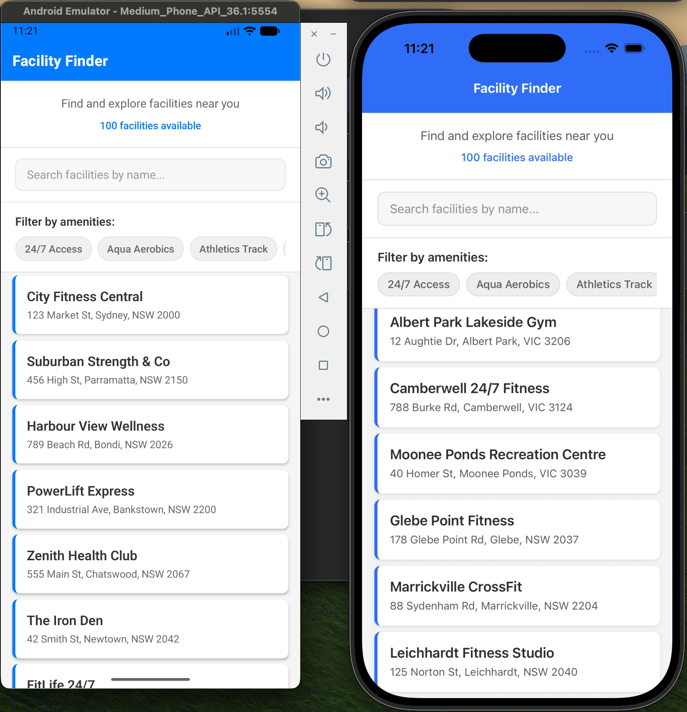
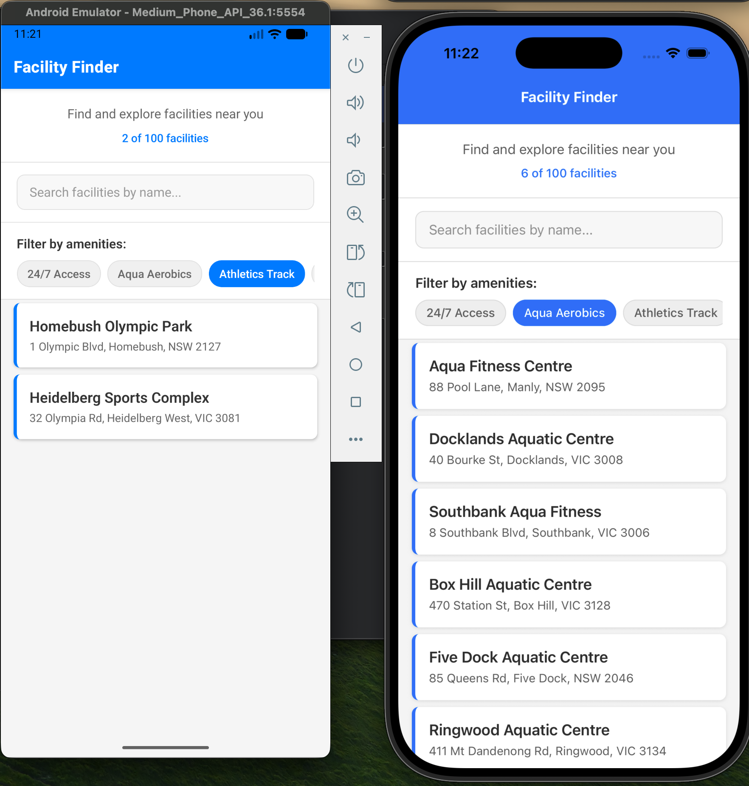
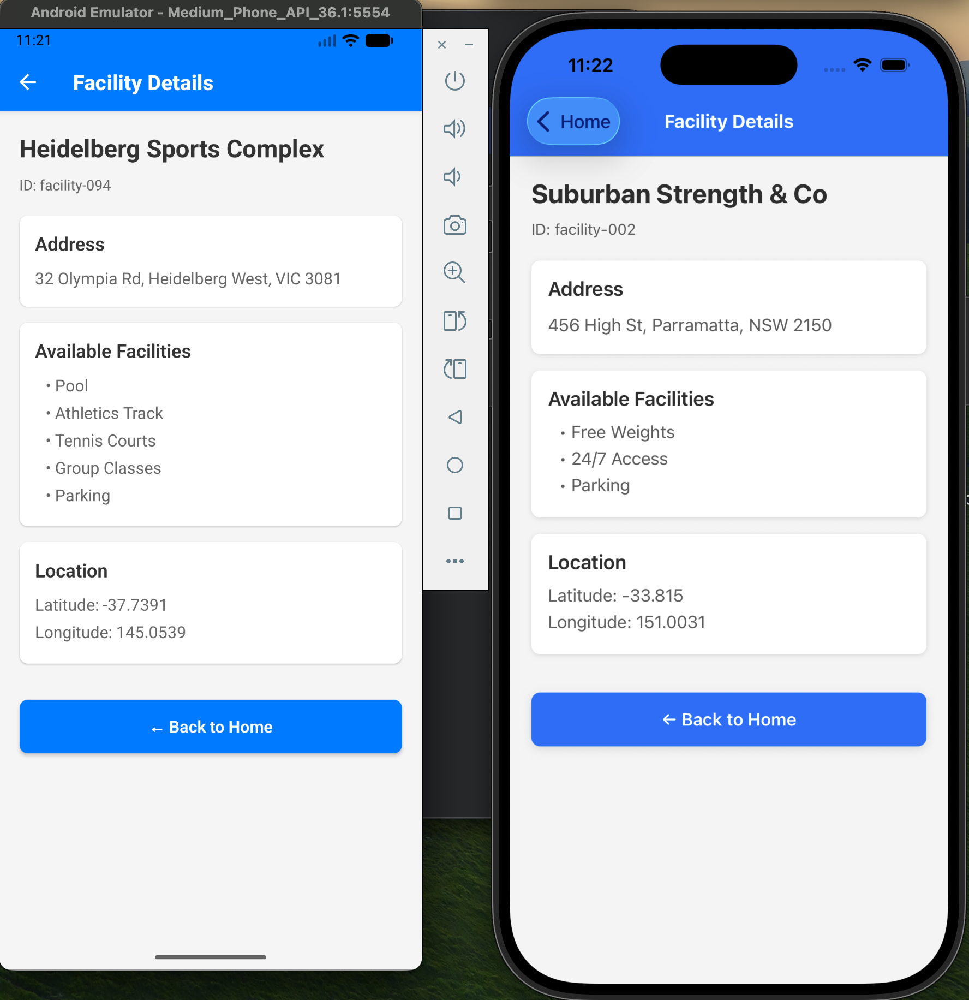

# Facility Finder - Coding Challenge

## Completion Status

✅ **Challenge completed in 1 hour and 10 minutes**

### Features Implemented:
- ✅ Home Screen with facility list and search functionality
- ✅ Detail Screen with complete facility information
- ✅ All stretch goals completed except unit tests


## Getting Started

### Prerequisites
- Node.js (version 14 or higher)
- npm or yarn
- Expo CLI (install globally with `npm install -g @expo/cli`)

### Steps to Run This Project

1. **Clone or navigate to the project directory:**
   ```bash
   cd /path/to/FitnessPassport
   ```

2. **Navigate to the app folder:**
   ```bash
   cd app
   ```

3. **Install dependencies:**
   ```bash
   npm install
   ```

4. **Start the Expo development server:**
   ```bash
   npx expo start
   ```

5. **Run on your preferred platform:**
   - For iOS: Press `i` in the terminal or scan QR code with Camera app
   - For Android: Press `a` in the terminal or scan QR code with Expo Go app
   - For Web: Press `w` in the terminal or open the web URL shown

## Screenshots





